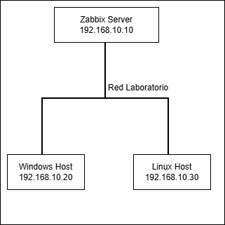

# Zabbix Monitoring Lab

## Descripción

Laboratorio práctico de monitorización de infraestructura IT con Zabbix.

Este laboratorio simula un entorno donde un equipo IT necesita monitorizar la disponibilidad y métricas básicas de varios equipos desde una consola centralizada.

> Laboratorio inspirado en situaciones reales de operación IT, recreado en un entorno controlado y sin datos sensibles.

## Objetivos

- Instalar y configurar Zabbix Server.
- Añadir hosts Windows y Linux.
- Monitorizar disponibilidad mediante ICMP.
- Configurar Zabbix Agent.
- Crear un dashboard básico.
- Generar y validar una alerta controlada.
- Documentar el procedimiento y resultados.

## Tecnologías utilizadas

- Zabbix
- Ubuntu Server
- Windows
- Linux
- ICMP
- Zabbix Agent
- Dashboards
- Triggers

## Topología

## Estructura del repositorio

docs/
screenshots/
diagrams/
scripts/
