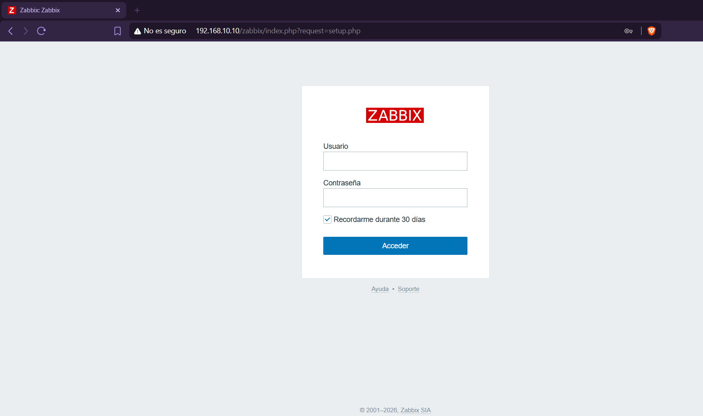
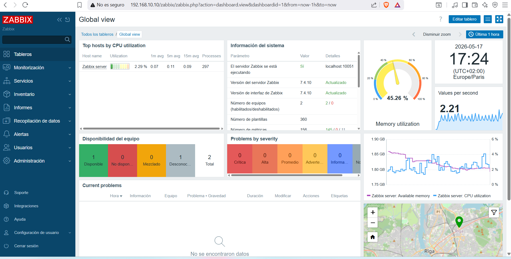
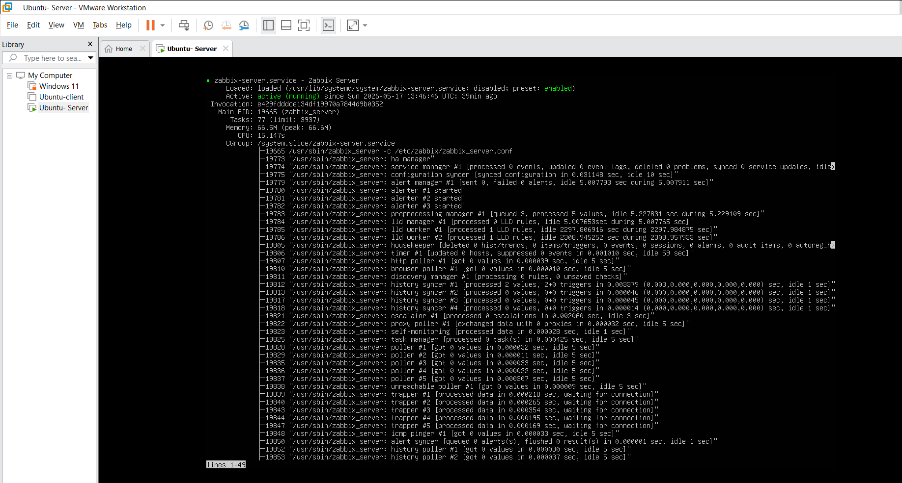

# Instalación de Zabbix Server

## Objetivo

Instalar Zabbix Server en Ubuntu Server para centralizar la monitorización del laboratorio.

## Pasos generales

1. Actualización del sistema.
2. Instalación de repositorio oficial de Zabbix.
3. Instalación de Zabbix Server, frontend y agente.
4. Configuración de base de datos.
5. Configuración del frontend web.
6. Validación del servicio.

## Validaciones

```bash
systemctl status zabbix-server
systemctl status apache2
systemctl status mysql
```







