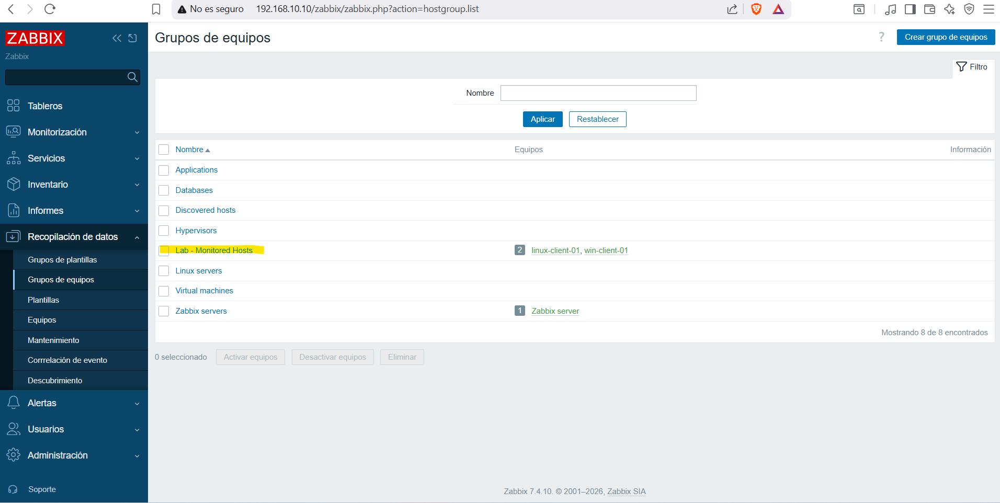
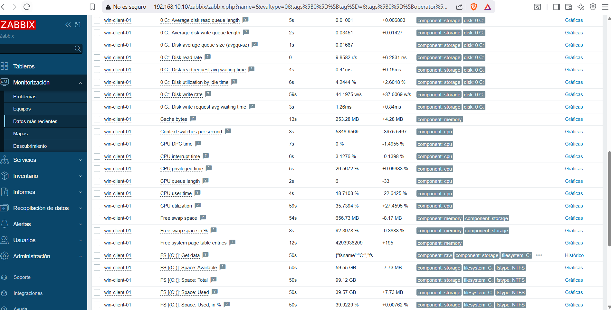
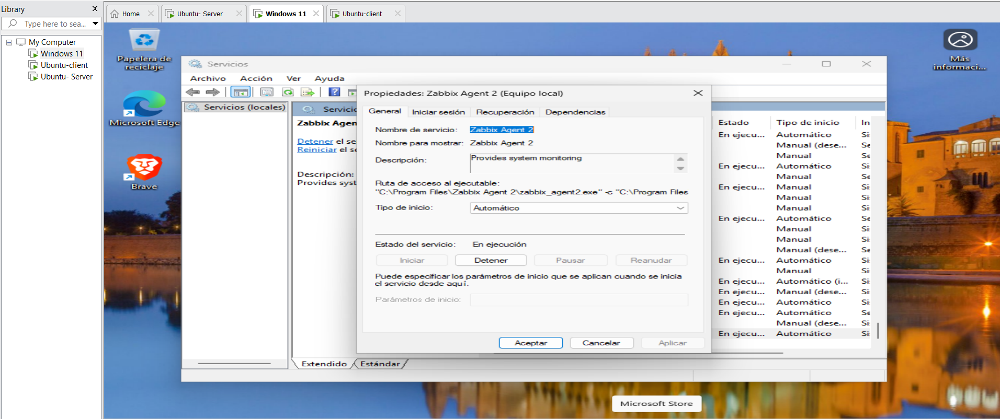
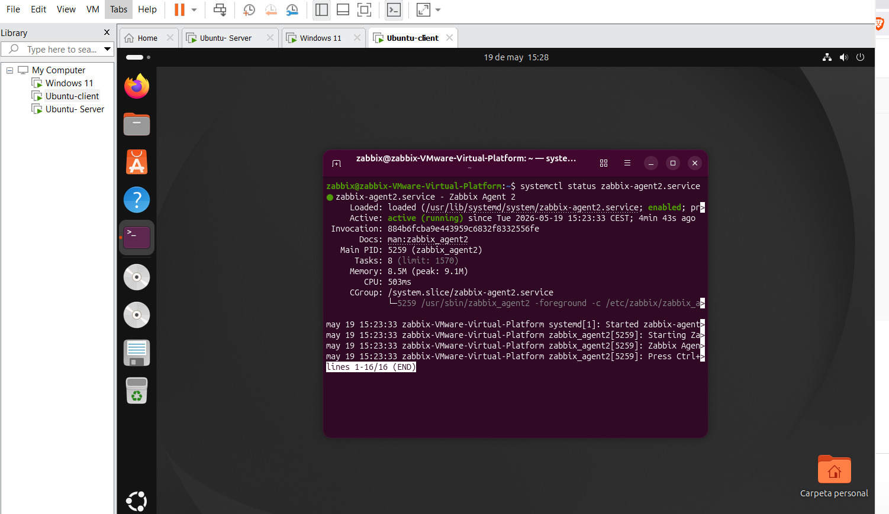

# Configuración de hosts en Zabbix

## Objetivo

Añadir hosts Windows y Linux al servidor Zabbix para monitorizar disponibilidad y métricas básicas.

## Grupo creado

Se creó el grupo: Lab - Monitored Hosts

## Monitorización con Zabbix Agent

Además de ICMP, se configuró Zabbix Agent para obtener métricas básicas del sistema.

Métricas esperadas:

- CPU
- Memoria
- Disco
- Uptime
- Procesos
- Servicios básicos

  

## Validaciones realizadas

- El servicio del agente está iniciado.
- El puerto 10050 está accesible desde Zabbix Server.
- El host aparece como disponible por agente en Zabbix.

