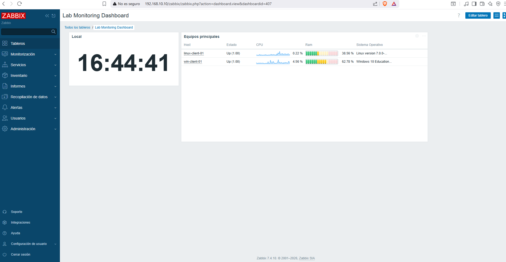
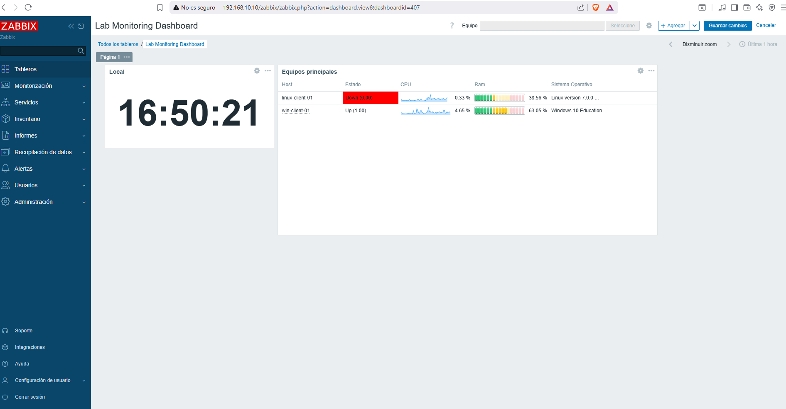

# Dashboard y alertas básicas

## Objetivo

Crear una vista centralizada para revisar rápidamente el estado de los hosts monitorizados.

## Dashboard creado

Nombre:
Lab Monitoring Dashboard

## Prueba de alerta

Se realizó una prueba controlada apagando uno de los hosts monitorizados.

## Resultado

Zabbix detectó la pérdida de disponibilidad y generó un problema asociado al host.

## Beneficio operativo

Este tipo de alerta permite detectar caídas o pérdidas de conectividad sin depender únicamente del reporte del usuario.
